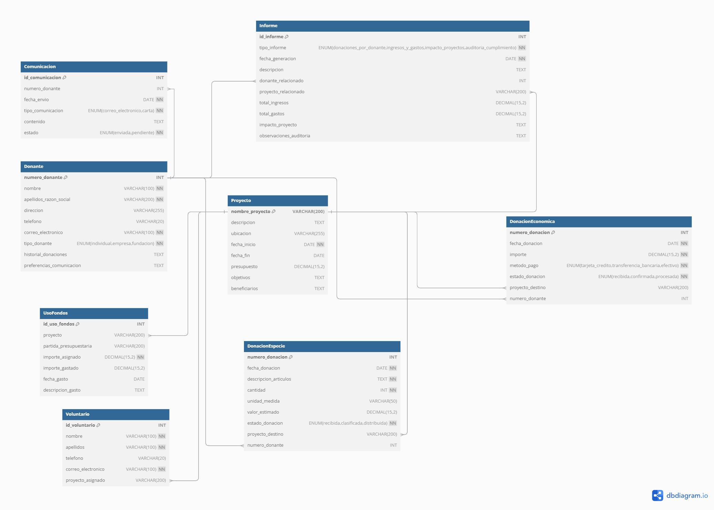
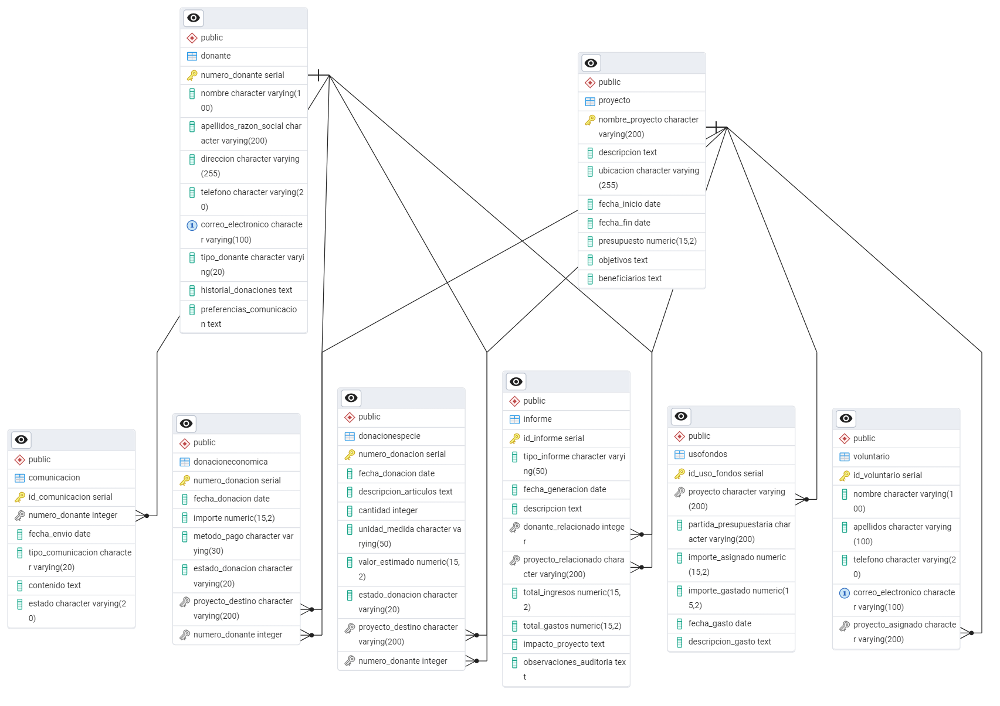

# 🌎 Sistema de Gestión Integral para ONG


Sistema de base de datos relacional diseñado para optimizar la operativa de la Organización No Gubernamental **"Ayuda en Acción"**. Centraliza la gestión de donors, la trazabilidad de fondos, la asignación de recursos a proyectos y la automatización de reportes de impacto, garantizando transparencia y eficiencia en la ayuda humanitaria.

---

## 📊 Resumen Ejecutivo

Este proyecto resuelve la dispersión de información común en ONGs —hojas de cálculo dispersas, registros manuales, archivos inconexos— que dificulta la toma de decisiones y la rendición de cuentas. El sistema implementa un modelo de datos normalizado en **Tercera Forma Normal (3FN)** que permite:

- **🔗 Trazabilidad Total:** Seguimiento desde la recepción de la donación hasta su ejecución en terreno.
- **💳 Gestión Multicanal:** Soporte para donaciones monetarias (tarjeta, transferencia, pago móvil) y donaciones en especie.
- **🔍 Transparencia:** Vistas automatizadas para calcular el impacto financiero real de cada proyecto.
- **📧 Comunicación CRM:** Gestión de interacciones para mantener informados a los donors sobre el destino de sus aportes.

---

## 🛠️ Stack Tecnológico

- **Motor de Base de Datos:** PostgreSQL 17
- **Modelado:** Diagrama Entidad-Relación (DER) — lógico y físico
- **Optimización:** Índices B-Tree, Constraints de dominio y Vistas Materializadas para reportes de alto rendimiento

---

## 📂 Estructura del Proyecto

```
sql_ong_ayuda_accion/
├── docs/                       # Documentación de negocio y especificaciones
├── diagrams/                   # Diagramas Entidad-Relación (lógico y físico)
├── sql/
│   ├── 00_restore_completo.sql # Backup completo de la base de datos
│   ├── 01_schema.sql           # DDL: tablas, constraints, índices
│   ├── 02_data.sql             # DML: datos de prueba
│   └── 03_queries_example.sql  # DQL: consultas de análisis y reportes
└── README.md                   # Este archivo
```

---

## 📐 Diagramas ERD

### Diagrama Conceptual



### Diagrama Físico (PostgreSQL)



---

## 🚀 Instalación Rápida

### Prerrequisitos

- PostgreSQL 14 o superior (recomendado: v17)
- Acceso a terminal o cliente SQL (psql, pgAdmin, DBeaver)

### Pasos

1. **Clonar el repositorio**

   ```bash
   git clone https://github.com/darwinjcn/sql_ong_ayuda_accion.git
   cd sql_ong_ayuda_accion
   ```

2. **Crear la base de datos**

   ```bash
   createdb ong_ayuda_accion
   ```

3. **Cargar el esquema y datos** — elige una opción:

   **Opción A: Restauración completa (recomendado)**
   
   Ejecuta el backup completo en un solo paso:
   
   ```bash
   psql -U tu_usuario -d ong_ayuda_accion -f sql/00_restore_completo.sql
   ```

   **Opción B: Ejecución modular**
   
   ```bash
   psql -U tu_usuario -d ong_ayuda_accion -f sql/01_schema.sql
   psql -U tu_usuario -d ong_ayuda_accion -f sql/02_data.sql
   psql -U tu_usuario -d ong_ayuda_accion -f sql/03_queries_example.sql
   ```

---

## 💡 Características Técnicas

### 🗄️ Diseño de Datos y Normalización

El modelo está estructurado en **Tercera Forma Normal (3FN)** para eliminar redundancias y garantizar la consistencia de los datos.

| Tabla | Descripción |
|-------|-------------|
| `donante` | Información de donors individuales y empresas |
| `proyecto` | Iniciativas y frentes de ayuda |
| `donacioneconomica` | Donaciones monetarias registradas |
| `donacionespecie` | Donaciones en especie (bienes materiales) |
| `usofondos` | Asignación y ejecución de fondos |
| `voluntario` | Registro de talento humano |

**Integridad referencial:**
- Claves foráneas (`FK`) con políticas de borrado/actualización para evitar registros huérfanos
- Restricciones `CHECK` para validar dominios (estados válidos, montos positivos, tipos de pago)

### 📈 Objetos Avanzados

Vistas estratégicas para simplificar el reporting y la toma de decisiones:

- `vw_donaciones_totales_por_donante` — Agrega y totaliza las donaciones por donor
- `vw_impacto_proyectos` — Calcula el balance financiero en tiempo real (Ingresos − Gastos) por proyecto
- `vw_comunicaciones_pendientes` — Filtra tareas CRM pendientes de envío
- `vw_voluntarios_por_proyecto` — Listado consolidado del personal asignado a cada frente de ayuda

### ⚡ Optimización y Rendimiento

Índices en columnas críticas para garantizar tiempos de respuesta óptimos:

- Índices únicos sobre correos electrónicos (`donantes`)
- Índices de rango sobre fechas de donaciones y asignación de fondos
- Índices B-Tree en columnas de estado para agilizar filtrados

---

## 📄 Documentación

- 📋 **[Caso de Estudio](./docs/caso_estudio_37.pdf)** — Análisis del caso de negocio
- 📋 **[Reporte Completo NGO](./docs/reporte_completo_ong.pdf)** — Especificaciones funcionales y diccionario de datos

---

## 👨‍💻 Autor

Desarrollado por **Darwin Colmenares**  
*Especialista en Datos y Desarrollador Backend*

¿Necesitas ayuda con el proyecto o quieres conectar?

🌐 [LinkedIn](https://www.linkedin.com/in/darwin-colmenares/) | 📧 [colmenaresdarwin06@gmail.com](mailto:colmenaresdarwin06@gmail.com) | 💼 [Portafolio](https://darwinjcn.github.io/)